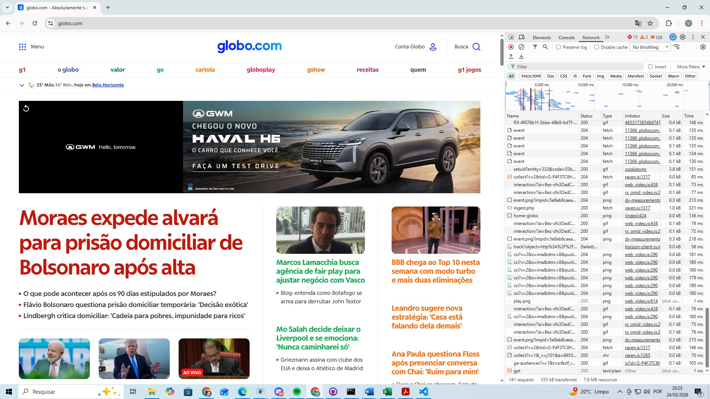
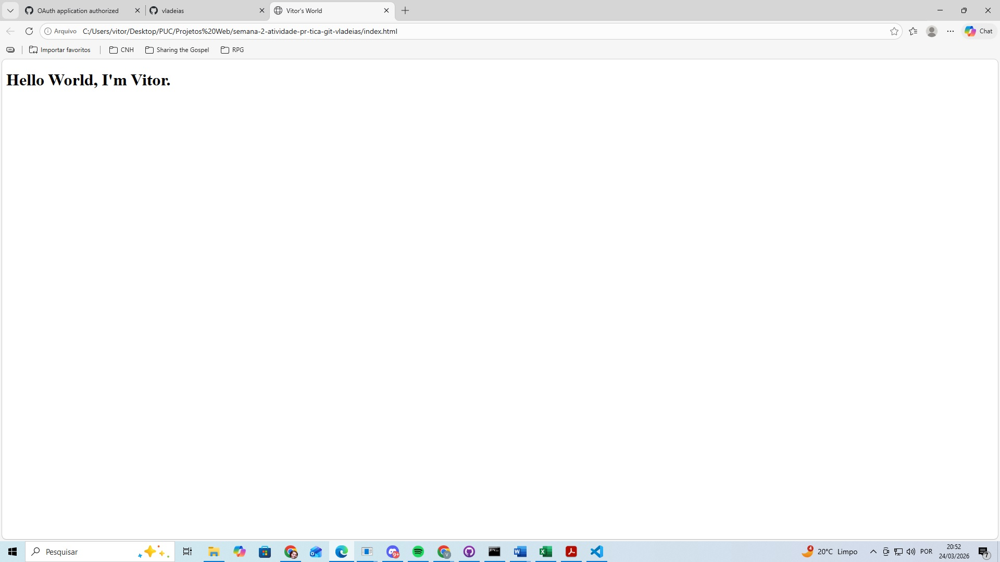

# Semana 2 - Atividade Prática Git

## Aluno
**Nome:** Vitor Ladeia Sepulveda

**Matrícula:** 914582

### Print da Tela inspeção de conexão:
Print da inspeção de conexão:

### Print da Tela da página index.html
Print do resultado do index.html:

